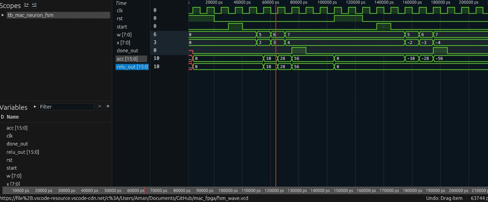
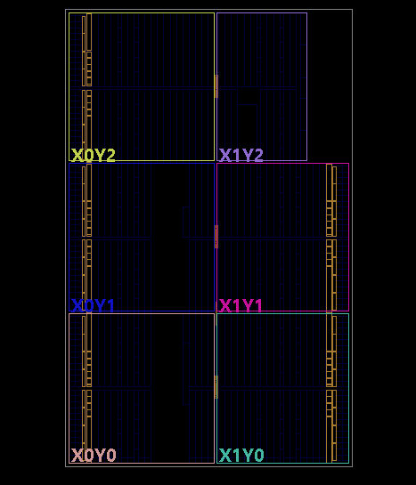
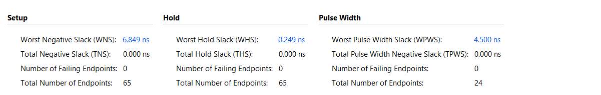

# MAC Neuron – FPGA-Based Edge AI Accelerator

## Overview

This project implements a custom neural network hardware accelerator using Verilog.  
The accelerator performs weighted-sum (Multiply–Accumulate) operations under FSM control, enabling low-power, real-time inference suitable for Edge AI applications.

The core operation implemented is:
y = w1·x1 + w2·x2 + w3·x3

This weighted sum forms the foundation of neural network inference.

Instead of executing this computation in software, the design maps it directly to FPGA hardware for deterministic performance and energy efficiency.

---

## Inputs

- `clk` – System clock
- `rst` – Reset signal
- `start` – Starts inference
- `x` – Input data
- `w` – Weight value

---

## Outputs

- `acc` – Accumulator (weighted sum output)
- `done_out` – Indicates completion of inference

---

## Architecture

The accelerator follows a **controller–datapath architecture**.

### Datapath

- Multiplier (`x × w`)
- Accumulator register (`acc`)
- Counter (`count`)
- Done comparator (`done`)

### Controller

- Finite State Machine (FSM)

The datapath performs computation, while the FSM controls execution flow.

---

## Finite State Machine Operation

The FSM consists of four states:

### 1. IDLE

Waits for the `start` signal.

---

### 2. CLEAR

Initializes the datapath:
acc = 0
count = 0

This prepares the accelerator for a new inference.

---

### 3. MAC

Main computation state.

- Enable signal (`en`) is asserted.
- Each clock cycle performs:
  acc = acc + (x × w)
  count = count + 1

The FSM remains in MAC until the required number of inputs has been processed.

Completion is detected using:
done = (count == N-1)

---

### 4. DONE

Final state.

- Computation stops.
- Output remains stable.
- `done_out` is asserted.
- FSM transitions back to IDLE for the next inference.

---

## Control Logic

- The counter tracks how many MAC operations have occurred.
- The `done` signal is generated from the counter.
- The FSM uses `done` to exit MAC state.
- FSM produces `clear` and `en` signals to control the datapath.

---

## Key Features

- FSM-controlled MAC datapath
- Fixed-point arithmetic
- Deterministic latency
- Low hardware complexity
- Suitable for Edge AI deployment
- Fully verified in Vivado simulation

---

## Summary

This project demonstrates a custom FPGA-based neural compute unit implementing weighted-sum inference using a controller–datapath architecture. By mapping neural operations directly to hardware, the design achieves predictable real-time performance with minimal power and resource usage, making it suitable for Edge AI applications.

---

## Update 1: ReLU Activation

This update introduces a ReLU (Rectified Linear Unit) activation stage to the hardware accelerator.

ReLU serves as the activation function in neural networks, introducing non-linearity by allowing positive values to pass through while clamping negative values to zero. This prevents stacked linear layers from collapsing into a single linear transformation and enables the network to model complex patterns.

### Implementation

A new signed output `relu_out` was added as the final accelerator output after activation.  
ReLU is implemented using simple combinational logic:

- If the accumulator (`acc`) is negative, `relu_out` is set to zero.
- Otherwise, `relu_out` passes the accumulated value directly.

This is achieved by checking the sign bit of the accumulator and conditionally assigning zero.

### Additional Fixes

While integrating ReLU, a reset-related issue was discovered: the accumulator and counter were not being cleared when `rst` was asserted. This caused incorrect results during consecutive inference runs.

The datapath reset logic was updated so that both the FSM and datapath registers (`acc` and `count`) are properly cleared on reset, ensuring clean operation for every inference cycle.

### Verification

Both positive and negative test cases were simulated:

- Positive accumulated values pass through ReLU unchanged.
- Negative accumulated values are correctly clamped to zero.

This confirms correct ReLU functionality and signed arithmetic behavior.

## Update 2: FPGA Deployment

This update deployed the system verilog code in vivado, mapping it to an FPGA to evaluate Hardware Usage, Timing Performance, and Power Consumption. Implementing into vivado also enabled in getting a device schematic, as well as a device synthesis

### Device Synthesis and Schematic

### Hardware Usage

- Slice LUTs: 89
- Slice Registers: 23
- DSP Blocks: 0
  

---

### Timing Performance

- Worst Negative Slack(WNS): +6.808ns
- Estimate Critical Path Delay: ~3.19ns
- Estimated Maximum Frequency(Fmax): ~313MHz
  

---

### Power Analysis

Vivado Power Estimates

- Total On-Chip Power: 0.072W
  

---

## Future Extensions

- ~ReLU activation~
- ~FPGA deployment~
- Multiple neurons / layers
- UART or GPIO interface
