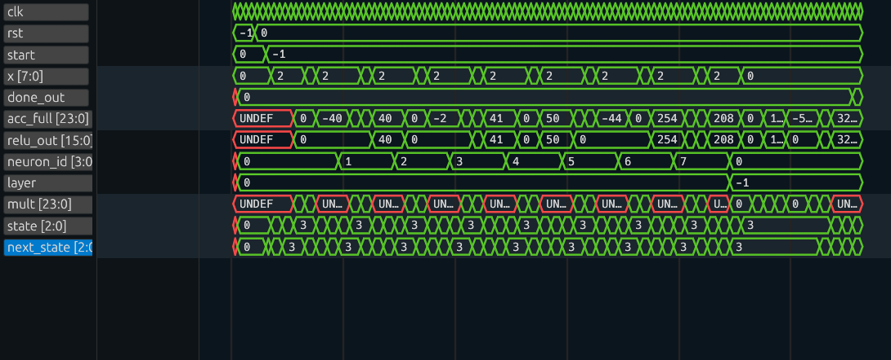
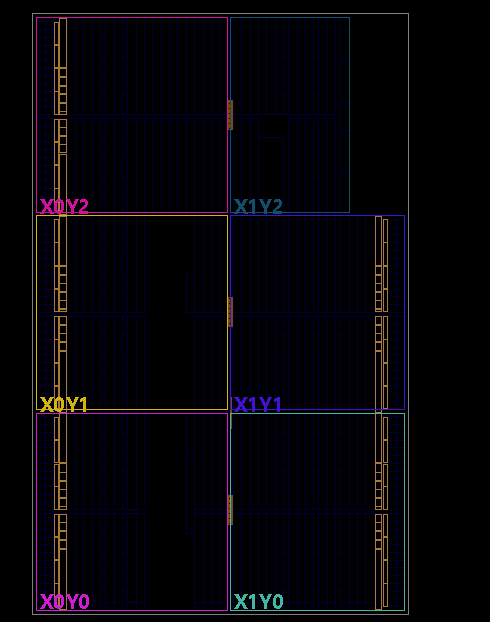

# MAC Neuron – FPGA-Based Edge AI Accelerator

## Overview

This project implements a custom neural network hardware accelerator using SystemVerilog.  
The accelerator performs weighted-sum (Multiply–Accumulate) operations under FSM control, enabling low-power, real-time inference suitable for Edge AI applications.

The core operation implemented is:
y = w1·x1 + w2·x2 + ... + wn·xn

This weighted sum forms the foundation of neural network inference.

Instead of executing this computation in software, the design maps it directly to FPGA hardware for deterministic performance and energy efficiency. The weights are pre-trained, quantized to `int8`, and embedded directly into the hardware fabric.

---

## Parameters

- `NUM_INPUTS` – Configures the number of MAC operations per inference cycle (e.g., 2 for the hidden layer, 8 for the output layer).

## Inputs

- `clk` – System clock
- `rst` – Reset signal
- `start` – Starts inference
- `x` – Input data (signed 8-bit)
- `weight_idx` – 5-bit address to select the corresponding pre-trained weight from the embedded ROM

---

## Outputs

- `acc` – Accumulator (raw weighted sum output)
- `relu_out` – Activated output (clamped to 0 if negative)
- `done_out` – Indicates completion of inference

---

## Architecture

The accelerator follows a **controller–datapath architecture** augmented with embedded memory.

### Datapath & Memory

- **Weight ROM**: A combinational lookup table containing the 24 quantized `int8` weights exported from the AI training pipeline.
- Multiplier (`x × weight_val`)
- Accumulator register (`acc`)
- Counter (`count`)
- Done comparator (`done`)

### Controller

- Finite State Machine (FSM)

The datapath performs computation and memory retrieval, while the FSM controls execution flow.

---

## Finite State Machine Operation

The FSM consists of four states:

### 1. IDLE

Waits for the `start` signal.

### 2. CLEAR

Initializes the datapath:
acc = 0
count = 0
This prepares the accelerator for a new inference.

### 3. MAC

Main computation state.

- Enable signal (`en`) is asserted.
- Each clock cycle performs:
  acc = acc + (x × weight_val)
  count = count + 1

The FSM remains in MAC until the parameterized number of inputs (`NUM_INPUTS`) has been processed.

Completion is detected using:
done = (count == NUM_INPUTS - 1)

### 4. DONE

Final state.

- Computation stops.
- Output remains stable.
- `done_out` is asserted.
- FSM transitions back to IDLE for the next inference.

---

## Key Features

- FSM-controlled MAC datapath
- Fixed-point (`int8` / `int16`) signed arithmetic
- **Embedded Weight ROM for standalone inference**
- **Parameterized architecture for dynamic layer sizing**
- Hardware ReLU activation
- Deterministic latency
- Highly optimized for FPGA deployment

---

## Update 1: ReLU Activation & Parameterization

This update introduced a ReLU (Rectified Linear Unit) activation stage to the hardware accelerator alongside an embedded weight ROM.

ReLU serves as the activation function in neural networks, introducing non-linearity by allowing positive values to pass through while clamping negative values to zero.

### Implementation Highlights

- **Embedded ROM:** The 24 quantized weights from the Python model are stored in a `case` statement lookup table (bypassing elaboration limits and synthesizing efficiently into FPGA LUTs).
- **Hardware ReLU:** Implemented using combinational logic to check the accumulator's sign bit. Negative values are clamped to `0`.
- **Layer Parameterization:** A `NUM_INPUTS` parameter allows the FSM to dynamically size itself for either the Hidden Layer (2 MAC ops) or Output Layer (8 MAC ops).

### Verification

The updated testbench confirms that the correct weights are fetched using `weight_idx`, positive values pass through untouched, and negative accumulations are correctly clamped to zero.

---

## Update 2: FPGA Deployment & Synthesis

The updated RTL was synthesized and implemented in Vivado to evaluate hardware utilization, routing, and power.

### Device Synthesis and Schematic

The generated schematic successfully demonstrates the synthesis of the `RTL_ROM` block feeding directly into the hardware multiplier alongside the FSM controller logic.

### Hardware Usage Estimates

- Highly optimized Slice LUT and Register utilization based on the integrated combinational ROM.
- Minimal on-chip power footprint.
- Stable timing parameters with positive Worst Negative Slack (WNS).

---

## Future Extensions

- ~~ReLU activation~~
- ~~FPGA deployment~~
- ~~Embedded Quantized Weights~~
- Multiple neurons / layers integration (Top-level Wrapper)
- UART or GPIO interface for live data streaming
